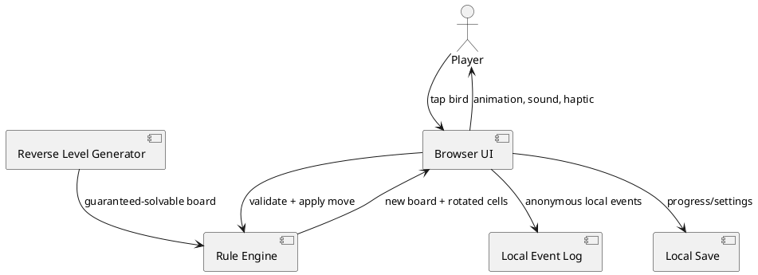
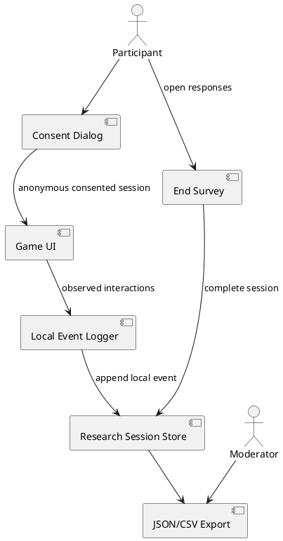
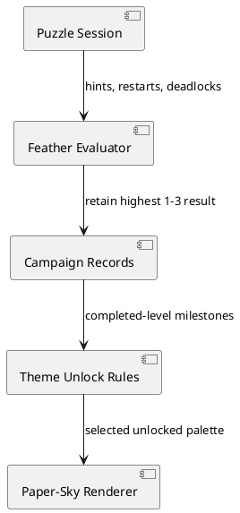
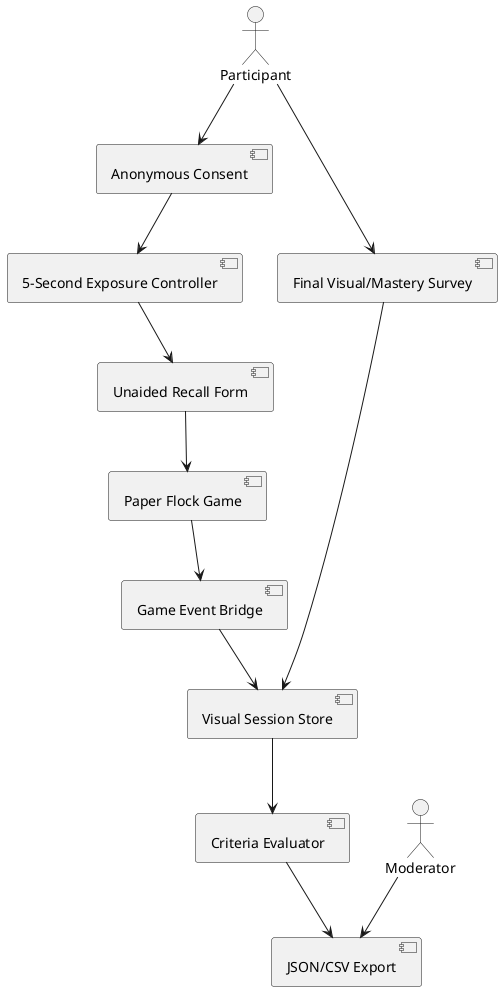
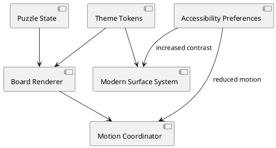
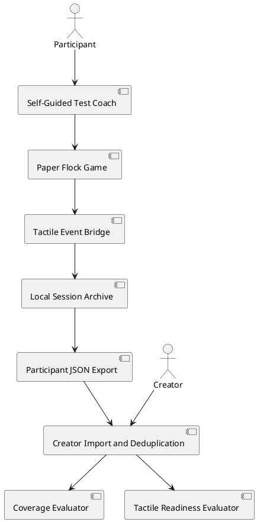

# SPEC-001-Paper-Flock

**Current validation build:** v0.11

## Background

Paper Flock is a zero-cash, solo-developed validation project. The prototype
tests whether a familiar directional-clearing action gains meaningful depth
when every escape rotates nearby pieces.

The project intentionally excludes monetization, accounts, cloud services,
live operations, and large content requirements.

## Requirements

### Must

- Run in a modern mobile or desktop browser.
- Explain the first action through the board and one short instruction.
- Provide a satisfying escape and rotation response.
- Include at least 20 guaranteed-solvable puzzles.
- Support undo, restart, and optional hints.
- Save progress locally.
- Collect playtest events locally and permit voluntary JSON export.
- Use no paid service, backend, tracking SDK, or copyrighted asset.
- Remain playable without sound and without color-only cues.

### Should

- Fit portrait phone screens and one-handed use.
- Support reduced-motion preferences.
- Keep the first level below approximately 30 seconds.
- Produce gameplay that can be understood in a short video.

### Could

- Add curated puzzle ratings after player testing.
- Add daily deterministic puzzles after retention validation.
- Port the validated loop to Godot for Android packaging.

### Won't — current prototype

- Advertising
- In-app purchases
- Accounts or cloud saves
- Leaderboards or multiplayer
- Push notifications
- Live events
- User-generated content

## Method

### Core rule

A bird may escape when every cell between it and the board edge, in its facing
direction, is empty. After escape, each occupied orthogonal neighbor rotates
90 degrees clockwise.

### Level generation

Start from an empty final board and repeatedly reverse a valid move:

1. Select an empty cell and a direction with a clear path to the edge.
2. Rotate occupied orthogonal neighbors 90 degrees counterclockwise.
3. Place the bird.
4. Repeat until reaching the target density.
5. Reverse the placement sequence to obtain one guaranteed solution.

Automated tests replay that solution for every shipped prototype level.

### Data storage

`localStorage` contains only:

- save version
- current and unlocked level
- completed level numbers
- sound preference
- local test events

No personal data is requested or transmitted.

## Implementation

1. Implement pure board rules in `src/game-core.js`.
2. Generate 20 deterministic reverse-solved boards.
3. Render accessible button cells in `src/game-ui.js`.
4. Animate escape and clockwise neighbor rotation.
5. Add undo, restart, hint, navigation, local save, and event export.
6. Verify the generator with Node's built-in test runner.
7. Conduct observed playtests before adding content or platform packaging.

## Milestones

| Milestone | Evidence required |
|---|---|
| First playable | All automated tests pass and level 1 is completable |
| Comprehension test | At least 80% understand the first action |
| Replay test | At least 60% voluntarily begin another puzzle |
| Differentiation test | At least 50% identify meaningful novelty |
| Port decision | Core loop meets thresholds after up to three iterations |

## Gathering Results

Export one local JSON event log after each session. Aggregate:

- time from open to first escape
- blocked taps before first legal move
- tutorial completion
- levels started and completed
- moves, undo, restart, and hint usage
- deadlocks
- voluntary next-level starts
- total session duration

Pair behavioral data with a five-question interview. Do not infer commercial
retention, monetization, or profitability from a small prototype sample.

## Need Professional Help in Developing Your Architecture?

Please contact me at [sammuti.com](https://sammuti.com) :)

## v0.5 research architecture

The research store is separate from gameplay progress. Starting a new
participant resets the game state but preserves previously completed anonymous
research sessions. No data is transmitted automatically.

## v0.6 healthy mastery and visual identity

The move-count record was removed because every successful solution requires
one removal per bird, making the metric structurally constant.

Feather award:

- completion = one feather
- no hint = second feather
- no hint, restart, or deadlock = third feather

Themes are cosmetic and unlock at 0, 5, 10, 15, and 20 completed campaign
levels. No currency, randomness, expiry, streak, or payment is involved.

## v0.7 visual-test architecture

The exposure, recall, play, and final-survey phases are stored separately.
Game events are copied through a browser custom event into the anonymous visual
session only after natural play begins.

## v0.8 modern visual architecture

Motion is limited to transforms and opacity where practical. Frequent actions
use short transitions; level entrance, bird flight, completion, and theme
changes receive the more expressive motion treatment.

## v0.11 self-guided field-test architecture

### Field session lifecycle

1. Participant opens `?fieldtest=1`.
2. The app creates a clean anonymous session.
3. Natural play is measured with Sound off and Effects Auto.
4. The coach introduces sound and haptics after sufficient natural play.
5. Low-end sessions exercise Lite effects.
6. The participant completes the final survey.
7. A single anonymous JSON result is downloaded.
8. The creator imports returned files into one local archive.
9. Duplicate session IDs and participant codes are rejected.
10. Coverage and product-readiness gates are evaluated separately.

### Evidence coverage gate

Closed alpha requires both:

- the existing tactile product criteria; and
- the target participant, device, protocol, sound, haptic, blocked-path, and
  rotation-learning coverage.

A technically strong but demographically incomplete sample returns
`NOT ENOUGH EVIDENCE`.
