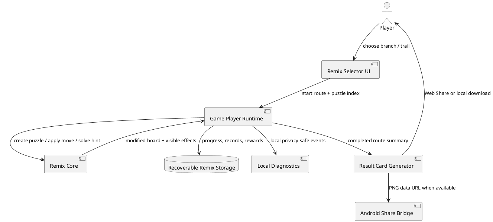

# SPEC-002-Paper-Flock-Remix-Flights

## Background

Paper Flock already provides a forty-level campaign, Daily Flock, permanent achievements, mastery feathers, themes, and a closed-test diagnostics build. The remaining product risk is repetition: players may understand the core rotation rule but feel that later sessions ask for the same type of decision.

Remix Flights adds rule variation without replacing the calm core puzzle or requiring a large second campaign. It remains optional, offline-first, local-only, and non-punishing.

## Requirements

### Must

- Provide three visibly explained modifiers: Linked Folds, Locked Fold, and Tailwind.
- Provide twelve curated, solver-verified Remix puzzles.
- Organize the puzzles into four three-puzzle routes across two branching flights.
- Preserve the existing forty-level campaign and schema-12 campaign save.
- Store Remix progress in recoverable local storage included in backup, restore, and reset.
- Avoid hidden randomness, streaks, timers, expiring rewards, paid skips, and forced play.
- Work with keyboard, touch, screen readers, reduced motion, forced colors, and compact mobile layouts.
- Log privacy-safe local events for selection, modifier activation, completion, reward unlock, and sharing.

### Should

- Unlock Remix after completing campaign Level 5.
- Award one cosmetic fold trail for each completed route.
- Generate a local 1080×1080 result card.
- Use Android native sharing when running in the Play Store wrapper.
- Allow replaying any completed route.

### Could

- Add more curated routes after closed-test evidence identifies a preferred modifier.
- Add archived weekly curated flights without streaks or expiry.
- Add optional Google Play Games achievements after production stability.

### Won’t

- Procedural Remix generation in v1.6.
- Competitive leaderboards.
- Random rewards or loot boxes.
- Energy systems, mandatory streaks, or expiring route rewards.
- Server accounts or automatic analytics uploads.

## Method



### Modifier algorithms

**Linked Folds**

1. Apply the normal escape and neighbor rotations.
2. If the escaping bird is one member of the marked pair and the partner remains, rotate the partner clockwise once.
3. Include the extra turn in the animation and diagnostic effect list.

**Locked Fold**

1. Compute normal clear-path moves.
2. Exclude the marked locked bird while the key cell is occupied.
3. When the key bird escapes, the locked bird becomes a normal legal move.
4. A tap on the locked bird explains the rule without applying a move.

**Tailwind**

1. Apply the normal escape.
2. Increment the successful-move counter.
3. When the counter reaches the public interval, rotate the marked remaining bird clockwise.
4. Reset the visible counter to the interval.
5. Include the move-counter phase in solver state deduplication.

### Storage

```text
paper-flock-remix:
  schemaVersion: 1
  completedRoutes: route ID[]
  completedPuzzles: puzzle ID[]
  bestFeathers: puzzle ID -> 0..3
  unlockedTrails: trail ID[]
  selectedTrail: trail ID

paper-flock-remix-backup:
  recoverable envelope backup of the same payload
```

The keys are included in the existing player backup and reset allowlists. Campaign save schema 12 is unchanged.

## Implementation

1. Add `src/remix-core.js` with immutable route definitions, modifier rules, solver, progress normalization, and reward logic.
2. Add `src/remix-ui.js` with the route selector, trail collection, modifier banner, and result-card generator.
3. Extend `src/game-player-ui.js` with Remix mode, modifier-aware moves, hints, deadlock detection, completion flow, and local events.
4. Add recoverable Remix keys to storage and player backup.
5. Add Android FileProvider-based local PNG sharing.
6. Add Remix modules to the production allowlist and offline service-worker cache.
7. Add responsive, forced-colors, mobile, and compact-landscape styles.
8. Add domain, packaging, Android, and browser regression tests.

## Milestones

1. Domain rules and twelve solver-verified puzzles
2. Branching route selector and mobile presentation
3. Recoverable progress and cosmetic rewards
4. Completion cards and Android sharing
5. Production/offline integration
6. Automated qualification
7. Closed-test evidence from real players

## Gathering Results

The closed test should measure:

- modifier comprehension without developer explanation
- completion rate for each puzzle and route
- retries, hints, deadlocks, and abandonment by modifier
- voluntary start of a second route
- favorite modifier and perceived fairness
- share-card use
- crash, ANR, save-loss, and startup-recovery incidents

Initial experiment gates:

```text
First Remix route completion        >= 65%
Voluntary second-route start        >= 45%
Players trying all modifiers        >= 40%
Players naming a favorite modifier  >= 50%
Critical fairness/confusion reports = 0
Save-loss or startup defects        = 0
```

These targets are hypotheses and must be revised from actual tester behavior.

