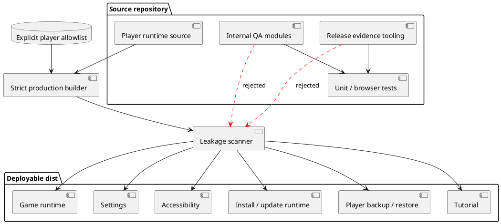

# Paper Flock v1.2 — Production Settings and Clean Release Report

## Decision

**PLAYER SETTINGS IMPLEMENTED AND PRODUCTION ARTIFACT CLEANLY SEPARATED**

The deployable release contains only player-facing runtime functionality.
Internal quality tools remain in the source repository for development and CI
but are excluded from `dist/` and the release ZIP.

## Production architecture



## Settings implementation

### Game

- persistent sound toggle
- independent haptic toggle
- effects preference with automatic, full, lite, and minimal modes
- unlocked theme selection
- tutorial replay

### Accessibility

- text scaling
- contrast preference
- motion preference
- immediate document updates
- persisted local preferences

### App and data

- online/offline state
- installed-app state
- conditional install action
- conditional update action
- player-only backup export
- validated backup restore
- confirmed player-data reset

### About

- current version
- Gamelo Studio publisher identity
- public support contact
- privacy, terms, support, accessibility, release notes, known issues, and
  credits

## Production-only runtime

The player document loads exactly eight modules:

```text
boot-guard.js
tutorial-player-ui.js
game-player-ui.js
app-platform-ui.js
mobile-lifecycle-ui.js
mobile-viewport-player-ui.js
accessibility-ui.js
settings-ui.js
```

The production service worker uses the same player-only resource boundary.

## Internal functionality excluded from production

- research participation and session collection
- prototype testing tools
- tactile and visual test interfaces
- field-test collection
- install-audit interface
- mobile certification collector
- accessibility certification collector
- beta operations dashboard
- performance diagnostic monitor
- production evidence importer and approval UI
- diagnostic query switches

## Build enforcement

The production builder:

1. Copies only top-level player assets and an explicit module allowlist.
2. Writes sanitized public configuration and build metadata.
3. Writes player-facing release notes and known issues.
4. Generates production robots and sitemap files.
5. Scans filenames and HTML, JavaScript, and JSON content.
6. Rejects internal modules, testing query modes, prototype text, or evidence
   tooling.
7. Hashes every deployed file.

## Validation

| Check | Result |
|---|---:|
| Automated tests | **175 passed** |
| Failed tests | **0** |
| Production configuration | Passed |
| Package architecture audit | Passed |
| Accessibility/security audit | Passed |
| Supply-chain audit | Passed |
| Strict production build | Passed |
| Release size/hash audit | Passed |
| Independent leakage scan | Passed |
| Internal QA markers found in deployable artifact | **0** |
| Player runtime scripts | **8** |
| Release files | **45** |
| Runtime size | **644,862 bytes** |
| JavaScript size | **190,509 bytes** |
| Stylesheet size | **120,773 bytes** |

Release SHA-256:

```text
93c8b506e8abe062b7205a9b1e4892829c5949520e8a73d8cfe81271b440e6b7
```

## Source package versus release package

The **complete project ZIP** contains source code, automated tests, audits, and
internal CI tooling. Contractors and GitHub Actions use this package.

The **deployable release ZIP** contains only the clean player artifact and its
SBOM. This is the production package.

GitHub Pages must deploy the workflow-generated `dist/` artifact, not the
repository root.

## Remaining release action

Push v1.2 to `main`, wait for the browser, Lighthouse, CodeQL, dependency,
deployment, SBOM, and provenance jobs to pass, then archive the v1.2 workflow
evidence with this release digest.
