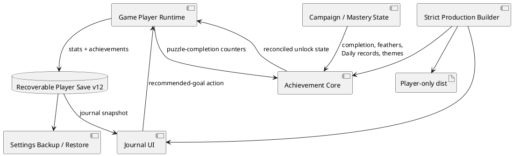

# Paper Flock v1.4 — Achievement Journal Implementation Report

## Decision

**IMPLEMENTED AND READY FOR GITHUB-HOSTED RELEASE QUALIFICATION**

Paper Flock now has a permanent local Achievement Journal, retroactive
milestones, lifetime player statistics, and a next-goal recommendation without
streaks, expiring rewards, energy, paid progression, or artificial waiting.

## Background

The forty-level campaign provides enough content for a longer-term progression
layer. The next product risk was not a lack of levels, but a lack of a clear
record of what the player had accomplished and what meaningful goal remained.

## Requirements

### Must

- preserve every v1.3 save and campaign unlock
- evaluate achievements retroactively
- display transparent progress toward locked achievements
- store statistics and achievement state in the recoverable local save
- provide an accessible mobile-safe Journal
- recommend a useful next goal
- include the new player modules in offline play
- exclude internal testing functionality from production

### Should

- distinguish campaign, mastery, Daily Flock, and collection milestones
- provide an accessible unlock notification
- mark unseen achievements without requiring a claim action
- include Journal state in normal backup and restore

### Won’t

- streaks
- expiring rewards
- random reward boxes
- paid progression
- push-notification pressure
- social comparison or global leaderboards
- server accounts in this release

## Method



### Save schema

The v1.4 payload adds:

```text
playerStats:
  schemaVersion
  firstPlayedAt
  lastPlayedAt
  launches
  puzzleCompletions
  campaignCompletions
  dailyCompletions
  cleanCompletions
  totalMoves
  totalHints
  totalRestarts
  totalDeadlocks
  totalUndos

achievementState:
  schemaVersion
  unlocked: achievement ID → ISO timestamp
  seen: achievement ID[]
```

The stable primary and backup local-storage keys do not change.

### Reconciliation algorithm

1. Normalize the old save.
2. Infer minimum statistics from campaign, feather, and Daily records.
3. Evaluate all twenty public requirements.
4. Add newly satisfied IDs to the unlock map.
5. Suppress unlock toasts during migration.
6. Announce only thresholds crossed during later gameplay.
7. Persist the state inside the existing recoverable envelope.

### Next-goal algorithm

1. Find the first incomplete level at or below the unlock boundary.
2. When the campaign is complete, find the first level below three feathers.
3. When campaign mastery is complete, recommend today’s optional Daily Flock.
4. When all three are complete, show a non-actionable completion state.

## Implementation

- `src/achievement-core.js` contains pure normalization, evaluation,
  reconciliation, statistics, and recommendation logic.
- `src/journal-ui.js` contains the accessible player Journal and unlock toast.
- `src/game-player-ui.js` owns persistence and game-to-Journal events.
- save schema advanced from 11 to 12
- service worker and production allowlist include only the two player modules
- browser tests cover migration, goals, persistence, and mobile scrolling
- unit tests cover every achievement and statistics rule

## Milestones

1. Achievement and statistics domain
2. Recoverable-save migration
3. Journal interface and accessibility
4. Recommended replay goal
5. Offline and strict-build integration
6. Automated tests and production audits
7. GitHub-hosted browser and physical-device qualification

## Gathering Results

Release evaluation measures:

- successful v1.3 save migration
- exact-once statistic updates
- correct retroactive achievement count
- correct new-unlock behavior
- Journal keyboard and screen-reader behavior
- mobile internal scrolling
- offline loading
- absence of streak and expiring-reward functionality
- absence of internal QA modules in the release


## Final qualification

| Check | Result |
|---|---:|
| Automated tests | **194 passed** |
| Failed tests | **0** |
| Achievements | **20** |
| Campaign solver gate | **40/40 passed** |
| Package architecture | **Passed** |
| Accessibility/security | **Passed** |
| Supply chain | **Passed** |
| Strict production build | **Passed** |
| Internal QA markers | **0** |
| Offline resources | **43/43 present** |
| Player runtime scripts | **9** |
| Release files | **48** |
| Runtime size | **714,007 bytes** |
| JavaScript | **242,838 bytes** |
| Stylesheets | **136,203 bytes** |

Release SHA-256:

```text
1a1e9d7a6d32cf473f619a041df533776b7ee6b433694bf03458612ae50b4973
```

### Browser execution

Spreadsheet runtime warmup failed during python startup
Traceback (most recent call last):
  File "/tmp/tmp.yTcnQsZYiA/artifact_tool_v2-2.8.4/artifact_tool/patches/warm_spreadsheet_runtime_on_startup.py", line 26, in warm_spreadsheet_runtime_on_startup
  File "/tmp/tmp.yTcnQsZYiA/artifact_tool_v2-2.8.4/artifact_tool/spreadsheet_warmup.py", line 785, in warm_spreadsheet_runtime
  File "/tmp/tmp.yTcnQsZYiA/artifact_tool_v2-2.8.4/artifact_tool/spreadsheet_warmup.py", line 720, in _warm_feature_flows
  File "/tmp/tmp.yTcnQsZYiA/artifact_tool_v2-2.8.4/artifact_tool/spreadsheet_warmup.py", line 704, in _warm_collaboration_flows
  File "/tmp/tmp.yTcnQsZYiA/artifact_tool_v2-2.8.4/artifact_tool/generated/interface/models.py", line 30820, in hydrate_crdt_from_proto
  File "/tmp/tmp.yTcnQsZYiA/artifact_tool_v2-2.8.4/artifact_tool/rpc/remote.py", line 749, in __call__
  File "/tmp/tmp.yTcnQsZYiA/artifact_tool_v2-2.8.4/artifact_tool/rpc/client.py", line 150, in call
artifact_tool.rpc.client.RemoteError: hydrateCrdtFromProto requires an empty collaborative document.
error: unknown command 'test'

The browser suite is syntax-valid and remains configured for GitHub-hosted
Chromium and WebKit. Physical Android and iPhone Journal verification remains
a release gate.
