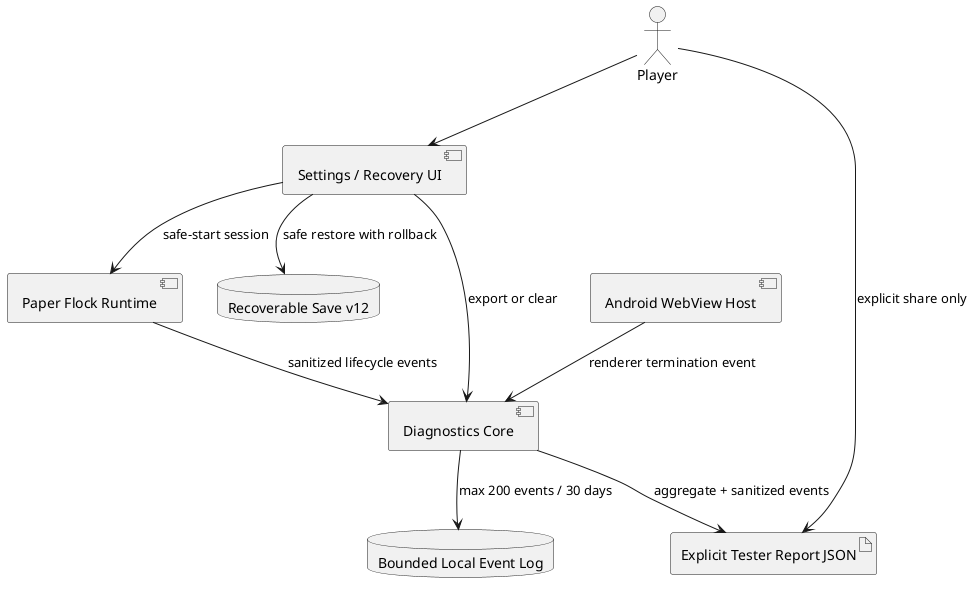

# SPEC-005-Paper-Flock-v1.5-Closed-Test-Quality-Build

## Background

Paper Flock v1.4.5 completed the mobile-first interface repair. The next release risk is no longer missing controls or layout coverage; it is the ability to diagnose real tester failures without adding invasive analytics, losing saves, or asking testers to reproduce technical details manually.

Version 1.5.0 therefore adds a privacy-safe closed-test quality layer while preserving the forty puzzle boards, save schema 12, ethical engagement model, and existing player preferences.

## Requirements

### Must

- Keep diagnostics local unless the player explicitly exports a tester report.
- Never include raw saves, board contents, email addresses, local paths, storage dumps, or unrestricted URLs in the normal tester report.
- Keep a bounded rolling event history.
- Allow startup recovery without deleting or overwriting recoverable progress.
- Roll back a failed backup import.
- Recover from Android WebView renderer termination.
- Preserve the v1.4.5 mobile layout and sound-on default for new players.
- Keep the production runtime free of automatic analytics uploads.

### Should

- Record startup, puzzle lifecycle, deadlock, hint, undo, restart, backup, recovery, and Android renderer events.
- Let testers export and clear local test history from Settings.
- Provide a fifteen-person, fourteen-day closed-test plan.
- Keep diagnostics understandable enough for support triage.

### Won't

- Add third-party analytics.
- Upload diagnostics automatically.
- Add accounts, advertising identifiers, location collection, monetization, streaks, or gameplay-rule changes.
- Mark the release production-approved before hosted browser, Android, and real-user qualification.

## Method

### Diagnostic event policy

The local recorder accepts a small event name and sanitized primitive detail. It rejects or redacts sensitive fields and values, including raw save data, storage contents, board layouts, filesystem paths, email addresses, and unrestricted URLs. The log retains at most 200 events and removes entries older than 30 days.

### Safe-start algorithm

1. Detect a startup exception.
2. Preserve the primary save and backup unchanged.
3. Offer retry, restore recovery save, safe start, tester-report export, raw recovery export, or cache refresh.
4. In safe-start mode, load a temporary default state.
5. Suppress normal persistence for that session.
6. Exit safe-start mode only through an explicit player action or fresh launch.

### Safe backup restore

1. Validate that the import contains at least one valid save envelope.
2. Snapshot all player-owned storage keys.
3. Apply the restore plan.
4. Verify that at least one recoverable save remains.
5. Roll back the entire snapshot when verification fails.

### Android renderer recovery

The native host detects a terminated WebView renderer, records a bounded native diagnostic event, removes and destroys the failed WebView, and recreates the activity. The web runtime consumes the event on the next launch and includes it in the local diagnostic history.

## Implementation

- Added `src/diagnostics-core.js` and `src/diagnostics-ui.js`.
- Added tester-report export and local-history clearing to Settings.
- Added startup safe mode and expanded recovery actions.
- Added transactional backup restoration with rollback.
- Added Android `onRenderProcessGone` recovery and native diagnostic bridging.
- Added privacy and Data Safety language for local closed-test diagnostics.
- Added closed-test plan, tester instructions, and feedback capture template.
- Added unit and browser contracts for diagnostic privacy, safe start, restore rollback, and Android recovery.
- Synchronized the final web distribution into the Android asset bundle.

## Milestones

1. Local diagnostic domain and privacy boundary — complete.
2. Tester export and Settings controls — complete.
3. Startup and backup recovery hardening — complete.
4. Android WebView renderer recovery — complete.
5. Automated static and production qualification — complete.
6. GitHub-hosted browser, Lighthouse, Android lint, and signed AAB — external gate.
7. Play internal testing and fifteen-person closed test — external gate.
8. Production-access decision based on real evidence — pending.

## Gathering Results

Local qualification produced:

| Check | Result |
|---|---:|
| Automated tests | **220/220 passed** |
| Mobile UI audit | **78/78 passed** |
| Production controls inspected | **45** |
| Campaign solver and uniqueness | **40/40** |
| Browser tests configured | **108** |
| Production build | **50 files / 754,107 bytes** |
| Runtime dependency vulnerabilities | **0** |
| High or critical development findings | **0** |
| Android target SDK | **36** |
| Android permissions | **VIBRATE only** |
| Automatic diagnostic upload | **Disabled** |
| Production approved | **No** |

The remaining evidence must come from GitHub-hosted Chromium, mobile Chromium, WebKit, Lighthouse, Android lint and AAB generation, Play internal testing, physical Android devices, and the closed-test cohort. A tester report is supporting diagnostic evidence, not a substitute for observed behavior or Play Console stability data.

