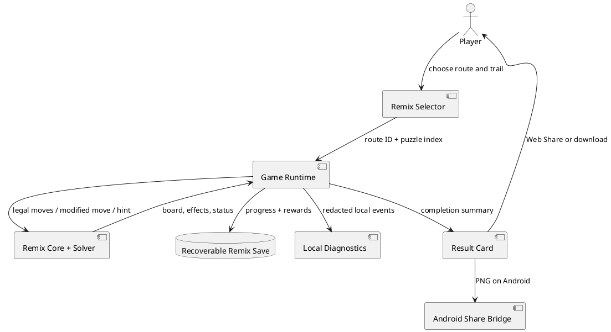

# SPEC-002-Paper-Flock-Remix-Flights — Implementation Report

## Background

Paper Flock v1.5.0 had a stable forty-level campaign, Daily Flock, achievements,
mobile-first controls, local diagnostics, and a Google Play closed-test path.
The next product risk was repetition: returning players could master the core
escape-and-rotation rule without receiving meaningfully different decisions.

Version 1.6.0 adds an optional Remix Flights mode that changes puzzle rules
without replacing the calm campaign or adding manipulative return pressure.

## Gamelo Studio Opening

Version 1.6.0 now includes a skippable first-launch introduction:

- “Gamelo Studio presents”
- “Paper Flock”
- “A calm origami puzzle”
- “Find the path. Turn the flock. Let the sky unfold.”
- “Created and published by Gamelo Studio”
- Primary action: “Begin the Flight”

Existing saved players are not interrupted. Players can replay the opening or
enable it for every launch in Settings. The opening supports keyboard focus,
Escape dismissal, screen-reader dialog naming, reduced motion, forced colors,
short mobile viewports, offline caching, and player backup/reset.

## Requirements

### Must

- Provide Linked Folds, Locked Fold, and Tailwind as visible, explained rules.
- Provide twelve curated, solver-verified Remix puzzles.
- Provide four three-puzzle routes across two branching flights.
- Preserve the campaign save schema and all existing player progress.
- Store Remix progress in recoverable local storage included in backup/reset.
- Keep the mode offline-first, account-free, and free of timers, streaks,
  energy, random rewards, paid skips, and automatic uploads.
- Support mobile, keyboard, screen-reader, reduced-motion, and forced-colors
  operation.

### Should

- Unlock after campaign Level 5.
- Award cosmetic fold trails for route completion.
- Generate a local 1080×1080 result card.
- Use the native Android share sheet where available.
- Record privacy-safe local events for closed-test evaluation.

### Could

- Add more curated routes after real-player evidence identifies preferred
  modifiers.
- Add archived weekly curated flights without expiry or streak penalties.

### Won’t

- Procedural generation in v1.6.0.
- Competitive leaderboards.
- Server accounts or automatic analytics.
- Loot boxes, energy, mandatory streaks, or expiring rewards.

## Method



The campaign save remains schema 12. Remix uses separate recoverable keys:

```text
paper-flock-remix
paper-flock-remix-backup
```

The payload stores completed routes, completed puzzles, best feathers,
unlocked trails, and the selected trail. Normal player backup, restore, and
reset include both keys.

## Implementation

- Added `src/remix-core.js` for immutable content, modifier-aware moves,
  legal-move evaluation, solver state, progress normalization, and rewards.
- Added `src/remix-ui.js` for route selection, trail selection, modifier
  explanations, and local result cards.
- Extended `src/game-player-ui.js` with Remix mode, completion flow, hints,
  deadlock detection, persistence, and diagnostic events.
- Added Android `FileProvider` sharing for locally generated PNG result cards.
- Added Remix modules to the strict production allowlist and offline cache.
- Added phone, compact-landscape, forced-colors, and reduced-motion styles.
- Added domain, packaging, Android, backup, statistics, and browser tests.

## Milestones

1. Three modifier algorithms implemented
2. Twelve curated puzzles solver-verified
3. Four branching routes implemented
4. Recoverable progress and four reward trails implemented
5. Local result-card sharing implemented
6. Offline, Android, backup, and production integration completed
7. Automated qualification completed
8. Real-player closed-test evidence pending

## Gathering Results

Local qualification results:

| Check | Result |
|---|---:|
| Automated tests | **238/238 passed** |
| Remix puzzles | **12/12 solver-verified** |
| Remix routes | **4** |
| Remix modifiers | **3** |
| Browser tests configured | **117** |
| Campaign solver/uniqueness gate | **40/40 passed** |
| Package audit | **60/60 passed** |
| Mobile UI audit | **85 checks passed** |
| Production controls inspected | **48** |
| High/critical dependency findings | **0** |
| Runtime dependency findings | **0** |
| Production release archive | **57 files / 498713 compressed bytes** |
| Production approved | **No — hosted and field evidence required** |

The closed test should measure first-route completion, voluntary second-route
starts, modifier comprehension, favorite modifier, retries, abandonment,
fairness reports, share-card use, crashes, ANRs, and save integrity.

Initial hypotheses:

```text
First route completion               >= 65%
Voluntary second-route start         >= 45%
Cohort trying all three modifiers    >= 40%
Players naming a favorite modifier   >= 50%
Hidden/unfair modifier reports       = 0
Save-loss or startup defects         = 0
```

Hosted Chromium, mobile Chromium, WebKit, Lighthouse, Android lint, signed AAB,
Play pre-launch, and physical-device execution remain external release gates.

